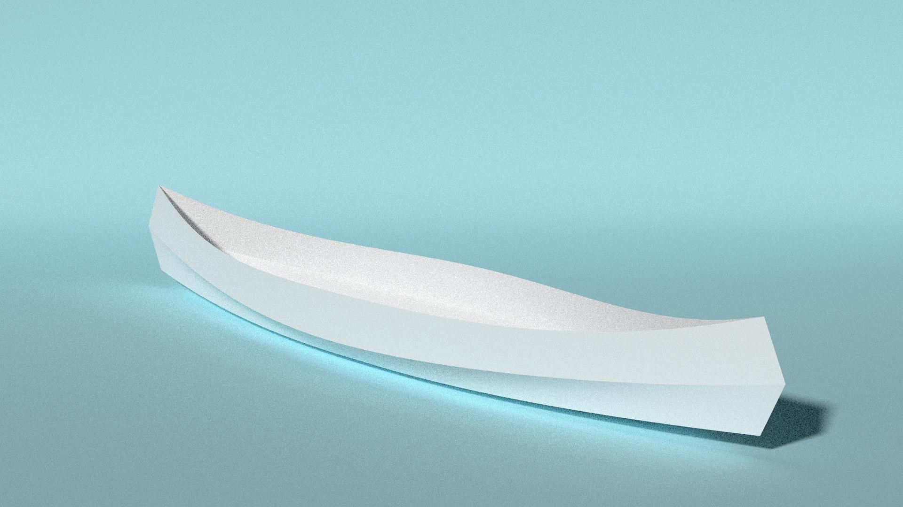
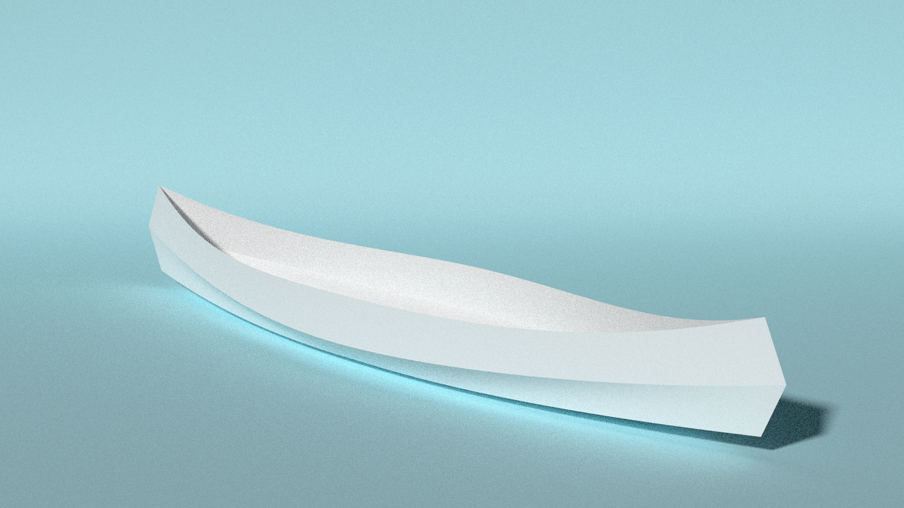

first-canoe
===========

3D model, render &amp; plans of my first canoe

This is a stitch & glue plywood canoe, model was made on Blender, and then faces were exported in svg. I used Inkscape to edit the svg file.

Not a lot of measures on the plan, up to you to figure this out !

]
]