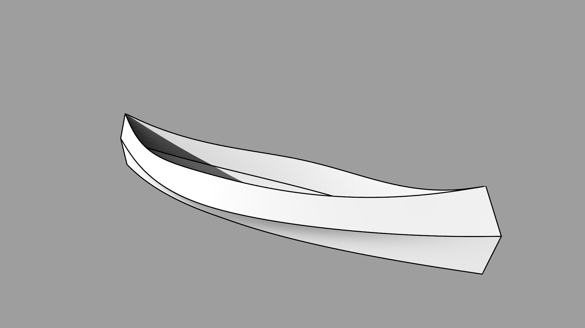

first-canoe
===========

Modèle 3D, rendus, et plans de mon premier canoë.
-------------------------------------------------

Pour un canoë en technique cousu-collé, contreplaqué + résine.

J'ai d'abord fait le modèle sous blender, puis exporté les faces à plat en svg. J'ai ensuite reporté la forme de ces faces sur du contreplaqué...
C'est plus un processus qu'un plan précis, l'idée est de se baser sur ces fichiers pour faire ton propre canoë aux mesures que tu veux.
Tu peux récupérer les plans et les modifier, en faire ce que tu veux. 
Ces fichiers sont sous license WTFPL ([http://www.wtfpl.net/](http://www.wtfpl.net/))

3D model, render &amp; plans of my first canoe
----------------------------------------------

This is a stitch & glue plywood canoe, model was made on Blender, and then faces were exported in svg. I used Inkscape to edit the svg file.

Not a lot of measures on the plan, up to you to figure this out !

WTFPL License  ([http://www.wtfpl.net/](http://www.wtfpl.net/))

